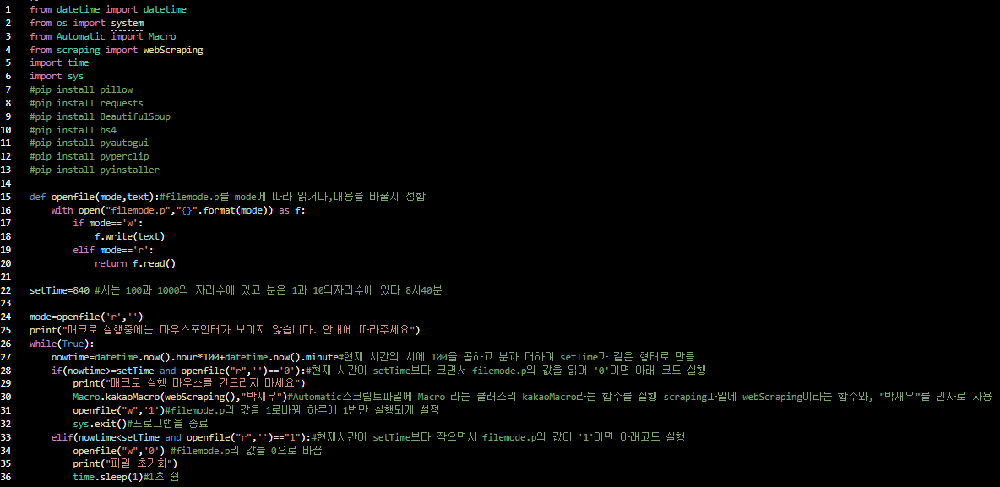
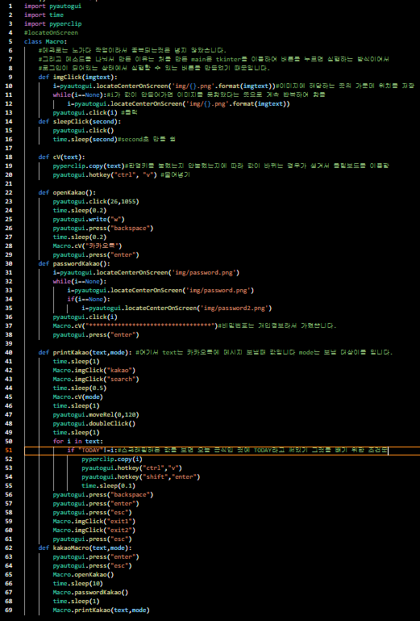
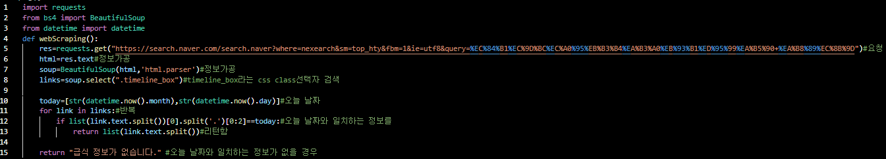

# kakaoAutoMacro
<html>
  <body>
    <h1>-------CODE--------</h1>
    -------main-------- 
     
    -------Automatic---- 
     
    -------scraping----- 
     
    이 프로그램은 카톡을 키는것부터 인터넷에서 스크래핑해온것을 원하는 곳에 보내준 다음 로그아웃까지 해주는 프로그램입니다.
    아래 영상에서 로그아웃 하고 이후에 움직이는 것은 오늘 급식이 맞는지 스크래핑제대로 한게 맞은지 확인을 위해서
    제가 움직인 것입니다. 
    <h3>파일을 업로드 되어있습니다.</h3>
    <a href="https://user-images.githubusercontent.com/88232976/164607475-e88feab9-2db1-4923-96fe-394171416657.mp4">실행영상보러가기</a>
  </body>
</html>

